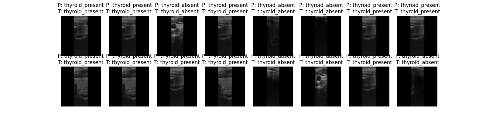
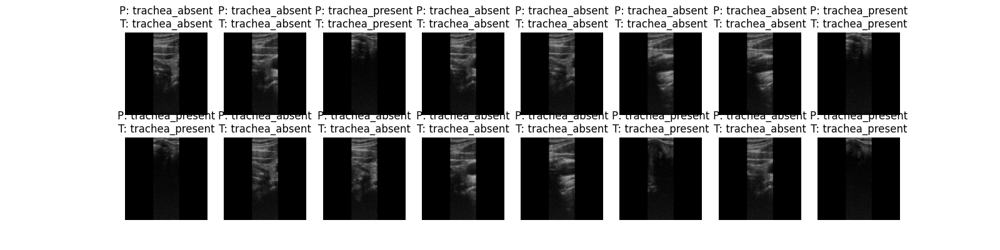

# Binary Classification of Medical Images using ResNet-18

This project uses ResNet-18 to classify ultrasound images according to the presence of a specific feature.

## Binary Classification
Binary Classification is defined as the process of analyzing data and making decision to categorized two elements. Binary classification model is used when we want to classify an item to one of two categories. This project focuses on applying binary classification to classifiy medical images into two categories, such as "organ absent" and "organ present". We successfully trained and implemented this binary classification model to detect the present of thyroid and trachea in a sequence of ultrasound images with high precision.

## ResNet-18
ResNet-18 is used as pre-trained model in this project. The reason is due to the limited dataset that we have. The current data that we have was collected independently, causing it to have less variant. ResNet-18 works better with small dataset and even better, it requires lighter computational power compared to ResNet-50-101, making it faster and more efficient. A less complex model like ResNet-18 reduced te risk overfitting, while still able to capture unique medical pattern. Transfer learning enable pre-trained model to be implemented to different type of images, including medical images such as ultrasound images.

## Pre-requisite
- Windows/Linux/MacOS
- Python
- CPU or GPU

## Organize folder directory 
In PyTorch, the most common way of doing image classification is to structure your dataset into folders by class. `torchvision.datasets.ImageFolder` will take folder name as class and it automatically assigns labels to each item in the folder according to the class, removing the need for manual labelling. Firstly, we create two folders named "train" and "validation" in out working directory. Train subfolder is used to store images for training while validation folder store validation images. The most common general-purpose split is 80 / 20. After creating both folders, create two subfolders in each folder, each named "x present" and "x absent" where x can be substitute with the organ that you are trying to classify. Load your data according to the label (folder name)

## Setup
Before running the code, ensure you have download all of the libraries required to run the model. Use the command below to install the necessary libraries:
- `pip install torch`
- `pip install torchvision`
- `pip install scikit-learn`

## Run the code
Once all the libraries are installed, run your code by through the terminal or through the running button. Once your code is succesfully run, the details of the current epoch, number of loss, and validation accuracy will appear. If the current running model perform better than the previous model, it will be save in a .pth format. Later, we use this file to load the weight for testing and real application purposes.

## Optimization
Your model performance can still be improved over time through hyperparameter tuning. Hyperparameter tuning can be done through multiple approaches including GridSearchCV, RandomizedSearchCV, and Bayesian Optimization. It is also important to note that we are aiming to collect higher amount of data to make our model as general and as accurate as possible.

